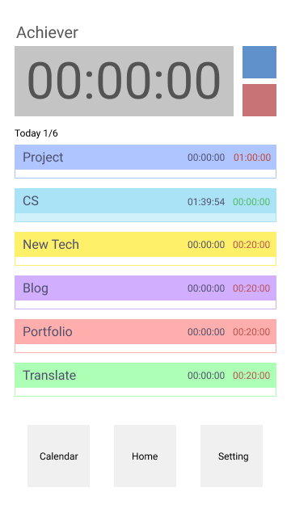
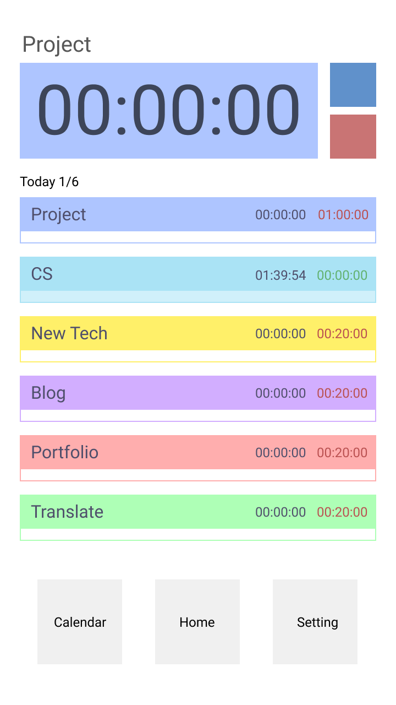
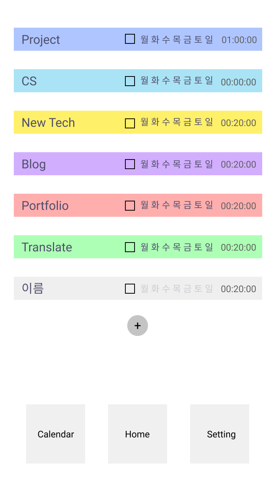

# Achieve App

요일별 해야하는 일/학습들에 각각의 최소 달성 시간을 설정하여 이들을 달성할 수 있도록 관리해주는 투두, 습관, 시간 측정 어플리케이션이다. 최소 달성 시간 뿐 아니라 초과 측정 할 수 있도록 하여, 자연스럽게 꾸준한 일/학습 습관을 키울 수 있도록 한다.

https://github.com/Nevaland/achieve-app

## 프로젝트 기획 내용

### UI

    
    
    

