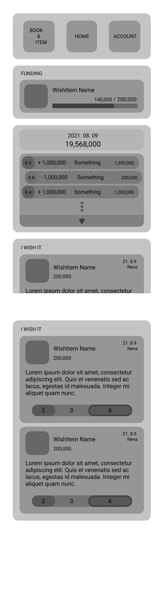
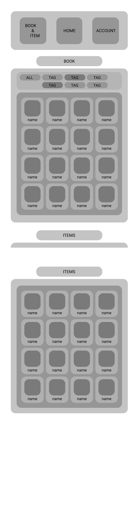
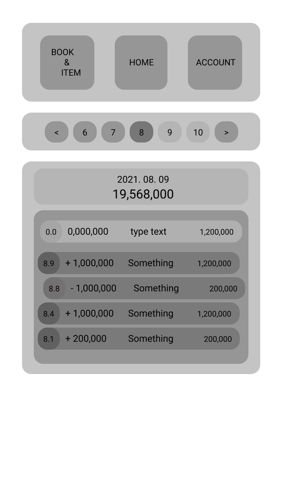

# Casper-Clicker

캐스퍼의 기자재 관리, 도서 대출, 회계, 좌석 정보, 위시 물품 펀딩 등의 기능을 제공할 어플리케이션 또는 웹 서비스

## 프로젝트 개요

### 기획 배경 및 목적

도서 및 기자재 관리, 회계와 관련된 기능들의 필요성을 느껴 기획하게 되었다. (웹 서비스와 어플리케이션 등으로 제공 될 수 있으며, 기획은 어플리케이션 관점에서 진행된다.)

### 기대 효과

- 도서의 반납과 대출을 포함한 간편한 도서 관리로 자신이 원하는 도서를 보다 쉽게 찾아보고 빌릴 수 있다.
- 회계 장부 기능으로 보다 투명하게 동방비를 관리하며, 간편하게 접근해 확인, 관리할 수 있다.
- 동아리 내의 기자재를 한 눈에 볼 수 있다.
- 위시 아이템 기능으로 기자재 구매를 위한 투표와 동방비 적금, 모금을 수행할 수 있다.

## 프로젝트 기획 내용

### 기능

- 도서 목록 조회, 도서 추가 및 수정, 삭제, 대출, 반납, 대출자 조회, 반납 요청
- 회계 장부 조회, 입금 및 출금 작성 (+계좌 연동)
- 기자재 조회, 기자재 추가 및 수정, 삭제
- 위시아이템 등록 및 취소, 위시아이템 구매 찬성 투표, 위시아이템 적금 및 모금 진행

### 데이터

- 유저
- 도서
  - book: title, author, price, image, desc, purchased_date, is_borrowed, borrower(fk user), wanted(int 0) (, comments)
  - tag: name
  - book_tag: tag(fk tag), book(fk book)
- 기자재
  - item: name, price, purchased_date, image, desc (, comments)
- 위시아이템
  - wish_item: name, price, link, image, desc, opinion, author, agreement(int), created_date, statue('d'iscuss, 'f'unding, 'c'ancel)
  - funding_item: item(fk wishitem), start_date, funding_period, funding_amount, funded_amount
- 회계
  - account_records: date(year, month), balance(int)
  - record: account_record(fk account_record), title, desc, amount, date, writed_date, writer(fk user)

// 도서, 물품이 여러개인 경우 여러번 추가한다. (각각의 특징을 살려 분별 가능하게 다르게 작성하면 좋음)

### UI

#### main(home), book and item, account

  
  

