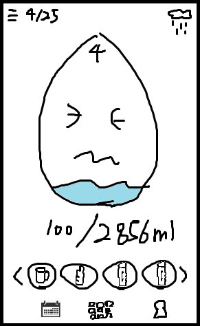
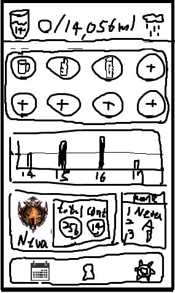
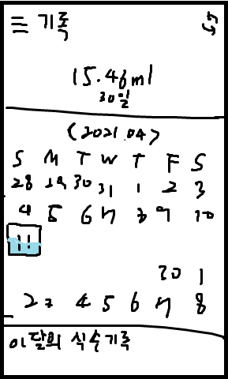
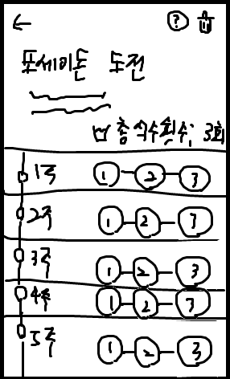

# Water Plouf

## 프로젝트 개요

물은 만병통치약이라 불릴만큼 건강에 도움된다는 사실은 모두가 알고 있다. 하지만 물을 섭취하는 습관을 들이는 것은 보기보다 어렵다. 마치 운동처럼 매일 물의 적당한 수준의 섭취를 돕도록 하는 어플리케이션을 기획해보았다.

앱의 이름은 물방울 캐릭터의 이미지로 떠오른 단어인 플루프를 사용하여 워터플루프로 지었다.

### 기획 배경과 목적

서버가 필요하지 않는 Stand Alone Application 이고, 개발 기간은 안드로이드 개발 경험이 있는 1인 개발자의 1달로 완료될 크기이며, 사용자들에게 유용한 어플리케이션의 아이디어가 필요한 지인이 있어 간단한 수준의 기획을 진행해 보았다.

## 프로젝트 내용

### 1. 물 권장 섭취량

나이, 신장, 몸무게와 날씨 등을 고려하여 날마다 그 날의 가장 적당한 물 섭취량을 계산하여 보여준다.

### 2. 물 섭취 기록

물 섭취량은 일반적으로 알고 있기 어렵다. 그렇기 때문에 자신이 물 섭취를 위해 사용하는 물 컵과 병 등의 용량을 등록해놓은 뒤, 해당 버튼을 클릭하는 것으로 그만큼의 물을 마신 것으로 기록한다.

조금 흘렸거나 조금 마셨거나 지레짐작하여 양을 기록하고자 할 때도 있는데, 이는 직관적인 UI 를 활용하여 물 섭취량 수치를 점차(천천히 가속) 감소/증가시킬 수 있도록 한다.

### 3. 물 섭취의 시각화 정보 제공

자신이 권장량에 얼만큼 달성하여 물을 마셔왔는지 달력과 그래프를 통해 쉽게 볼 수 있고, 오늘 마신 양 또한 메인에서 이미지를 통해 와닿게 느낄 수 있다.

### 4. 재미 요소와 섭취 자극 요소

어플리케이션의 사용을 활성화 시키고 물 섭취 습관을 보다 쉽게 안착시킬 수 있도록 '오늘의 물방울 친구를 키워낸다'는 컨셉과 연속 달성일, 총 달성일을 통한 랭크 등급과 랭킹, 친구와의 경쟁 및 비교 기능(서버를 사용할 경우에 이후 추가 고려)을 제공한다.

1. 물방울을 키워내자.  
   날마다 마치 슬라임 같은 물방울이 이슬에서 태어나고 말라있는 이 물방울을 나의 물 섭취로 물로 가득찬 건강한 물방울로 키워내는 설정이다.  
   이는 메인에서 인터렉티브한(이후 구현 고려) 캐릭터로 존재하며 섭취 달성의 성취감을 올려준다.

2. 랭크와 랭킹  
   권장량의 섭취를 달성한 날을 기록하여 총 일 수, 최대 연속 일 수를 보여주며, 이를 기반으로 게임과도 같은 랭크를 매겨낸다.  
   Rank Point의 계산식은 대략 total + continuous^2 이며 랭크는 사이 간격이 점차 증가하는 꼴을 띄며, 최상위 랭크는 약 133,225점이다. (시작부터 1년을 연속하여 마신 경우 도달)

3. 챌린지 미션  
   일종의 퀘스트와도 같은 개념으로 물 권장량 섭취를 매주 3회씩 달성이나 매일 연속으로 30일 달성과 같은 미션을 선택하여 도전 할 수 있는 기능으로 달성 시 달성 도장과 일정량의 Rank Point 받을 수 있도록 한다.

### 인터페이스

#### SAMPLE_UI : main, main_detail

#### SAMPLE_UI : calendar, challenge

