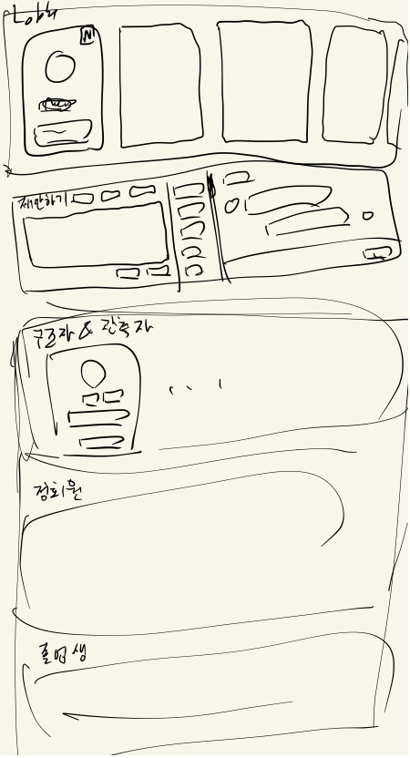

# Casper

backend: https://github.com/CASPER-REPSAC/casper-backend  
frontend: https://github.com/CASPER-REPSAC/casper-frontend

## 프로젝트 개요

### 기획 대상

동아리 Casper의 홈페이지 역할을 목적으로 하는 웹 서비스

### 기획 배경과 목적

기존의 동아리 홈페이지가 약 10년 이상 운영되어 연로해졌고, 새로운 동아리 서비스들이 기획 및 개발되면서 이를 통합할 플랫폼의 필요성과 이에 유리한 형태로 변모시켜야할 이유가 생겼다. 뿐만 아니라 동아리 홈페이지에 최신 트렌드를 반영하여 색다른 기능들과 선후배 간의 소통을 더 활성화시킬 기능들을 제작, 운영하고자 하여 기획 및 개발을 진행하게 되었다.

잠깐의 개발 및 시범 운영 후 긍정적인 결과와 의견이 될 경우 동아리 홈페이지를 대체하여 운영되고, 이후로도 지속적으로 유지 보수할 계획이며 천천히 모든 기능을 구현해 나갈 목적을 가지고 있다.

<sup>더불어 취업을 염두한 파일럿 프로젝트의 목적으로 django 기반 service 개발 및 운영, CI/CD와 테스트 개발 및 수행, 취약점과 버그의 이슈 처리와 유지 보수 등의 경험을 목적으로 개인 프로젝트로서 진행을 계획했다</sup>

### 기대 효과

깔끔하고 트렌디한 인터페이스가 갖추어지고, 다양한 서비스들의 접근성이 간편해질 것이다. 또한 기획된 서비스들로 선후배 간의 소통과 협업이 보다 원활해지고 이로 인해 동아리 인적 네트워크의 발전과 동아리 내의 소속감, 유대감이 강화된다.

### 주요 기능

- 게시판
  - 공지사항, 자유게시판, 준/정회원-졸업생 게시판
  - 사진첩
  - 블로그
- 커뮤니티
  - 로비 (관심사 어필, 멤버 소개, 스터디 개설 논의)
  - 스터디/프로젝트/CTF 모집 및 운영
  - 활동 내역
  - S.O.S (Rescue Signal)
  - RANK (활동가, 구조자, 관측자)
- 라이브러리
  - Roadmap (스터디 자료 모음)
  - Presentations (발표 자료)
  - Wiki, NAS (링크)
- 계정 관리
  - Oauth 로그인과 Token 동아리 인증
  - 회원 정보 수정
  - 작성 글 보기
- 기타
  - 동아리 연혁 (in 메인 페이지)
  - 블로그 포스트 리플렉션 (in 블로그)
  - Guest Ad-banner
  - emoji, gif
  - (Casper Wargame)

## 프로젝트 구상

프로토타입의 개발 및 서비스 운영, 디자인 개편과 Presentations/Community 기능 구현, emoji, Post Reflection과 Ad-banner 개발 및 적용의 과정으로 지속적 개발될 기획의 프로젝트이다. 단, 사용자들의 피드에 따라 변경, 중단될 여지가 있다.

- [1차 개발 구상 (2~4주)](#1차-개발-구상-24주)

### 1차 개발 구상 (2~4주)

약 2주의 개발 기간과 2주의 서비스 및 유지보수 기간을 기획하였으며, 전체 틀을 잡는 것을 목표로 두고 있다. 따라서 기능이 모두 구현되지 않는 프로토타입이며 메인 테스트 기능은 [Lobby](#4-Lobby)와 [S.O.S](#5-SOS), [Rank](#6-Rank) 기능이다.

1. [메인 페이지](#1-메인-페이지)
2. [네비게이션 바](#2-네비게이션-바)
3. [Boards](#3-Boards)
4. [Lobby](#4-Lobby)
5. [S.O.S](#5-SOS)
6. [Rank](#6-Rank)
7. [Links](#7-Links)
8. [Account](#8-Account)

#### 1. 메인 페이지


기간 상 단순 형태만 갖추어 구현하도록 하며, 로고, 네비게이션 바와 프로필 사진<sup>(계정 관리)</sup>이 위에 배치되어 있고, 그 아래로 기능성 배너<sup>(또는 단순 이미지 배너)</sup>를 둘 공간, 공지사항과 랭킹 블럭, 사진첩의 사진들, 그리고 커뮤니티와 블로그 글의 최신 글<sup>(하나씩을 보여주며 해당 카테고리로 이동시켜줄)</sup> 블럭들, 맨 아래로 동아리 연혁 등의 정보를 담고 있는 부분으로 구성되어있다.

메인 페이지는 두가지 특징을 가지고 있는데 블럭들로 구성되어 반응형 웹 페이지로서 블럭의 개수와 크기를 재배치하도록 하며, 동아리 인증 계정과 비인증 계정이 각자 다른 폼을 제공 받는다. <sup>(동아리 인증 사용자들만 동아리 내부 정보를 볼 수 있기 위함임. 미인증 사용자는 banner와 notice, blog, about us만 배치된다.)</sup>

#### 2. 네비게이션 바


네비게이션은 Main, Board, Community, Library로 노출이 되며, 세부 카테고리는 위와 같다.  
또한, 프로필 사진으로 버튼이 제공되고 확장되어 회원정보보기, 작성 글 보기가 제공되며 동아리 미인증 사용자에게는 동아리인증 기능이 함께 제공된다. (다음은 카테고리를 정리한 내용이다.)

```
Board
 - 공지사항
 - 자유게시판
 - 사진첩
 - 블로그
 - 준회원게시판
 - 정회원 게시판
 - 졸업생 게시판

Community
 - Lobby
 - Study
 - Project
 - CTF
 - Activitys
 - S.O.S
 - Rank

Library
 - Presentations
 - Roadmap
 - WiKi
 - NAS
```

#### 3. Boards

게시판은 기본적인 폼을 따르며, 하나의 게시판에 여러 카테고리가 다시 나뉘어질 수 있는 구조다. <sup>(기존 홈페이지의 게시판과 동일)</sup>  
해당 기획엔 포함되지 않으나, 이후 변경될 여지가 존재한다.

#### 4. Lobby



- 컨셉과 목적  
  로비는 마치 온라인 동아리 방과 같이 학생들이 대기하는 공간의 컨셉으로 듣고 싶은 스터디를 어필(관심사 어필)하며 또 그런 수요를 확인하고 새로운 스터디를 생성하는 활동이 활성화 될 수 있도록 하는 공간이다. <sup>(꼭 장기적으로 운영되어야하는 스터디가 아니라 1회의 가벼운 강의도 좋음)</sup> 더불어 동아리원들의 정보를 살펴볼 수 있다.<sup>(기존 Member 페이지)</sup>

- 기능
  1. 로비  
     정회원 중 어필 관심사를 등록한 회원의 어필 카드가 배치되는 공간으로 프로필사진, 닉네임, 관심사 어필 텍스트로 이루어져있다. 관심사 어필 텍스트라 함은 자신이 사람들과 스터디나 프로젝트와 같은 활동으로 새로이 배우고 싶은 분야/주제를 적는 공간이다. <sup>(ex. pwnable, network, django, rop, git,,)</sup>
  2. 제안하기  
     스터디/프로젝트/CTF 활동을 시작하기에 앞서 확실히 수요 조사와 방향에 대한 참여 예정자들과의 논의를 돕는 기능이다. 개설 고려자가 '제안하기'로 개설에 대한 고민이나 정보를 담아 글을 작성하게 되고, 작성된 글은 마치 카톡방을 개설한 것 같은 폼으로 등록된다.  
     동아리원들은 제안하기에 등록된 글에 대한 피드를 받아 해당 글을 보러 오게 되고, 채팅하는 것처럼 개설에 대한 논의를 천천히 수행해볼 수 있다. <sup>(꼭 개설 전, 논의 기능을 사용해야만 하는 것은 아니며, 논의하고자하나 따로 카톡하여 실시간 대화를 나누기는 어색/불편하고, 번거로운 경우에 사용하게 될 것)</sup>  
     논의가 완료되면 활동을 개설 또는 취소할 수 있다.
  3. 구조자 & 관측자  
     구조자와 관측자로 등록되어 있는 학생 중 졸업생들의 멤버 카드가 배치되는 공간이다. 어떤 선배들이 지켜보고 관심을 가져주고 있는지 한눈에 체감할 수 있으며, 아래에 기술될 멤버 카드와 동일한 카드이다.
  4. 정회원, 졸업생  
     정회원들의 멤버 카드가 배치될 공간과 졸업생들의 멤버카드가 배치될 공간이다. 멤버 카드에는 프로필 사진, 이름, 닉네임, 기술 스택이나 관심사, 소개 정보 등을 볼 수 있다. <sup>(구조자 & 관측자에 배치되는 것과 별개로 모든 인원의 멤버 카드가 배치되어있다.)</sup>

#### 5. S.O.S

구조 신호라는 컨셉으로 기획된 QnA 게시판이다. 단순히 글을 등록하여 브로드캐스팅되는 QnA 시스템에서 벗어나 구조 신호를 발사하여 구조자들이 구조해주러 오길 기다리는 컨셉으로 보다 더 QnA 활동을 자극시켜줄 수 있는 것이 특징이다.

QnA 작성은 제목, 내용, 태그와 마감 기한을 입력해 작성되며, 글을 등록 하게되면 구조 신호 불꽃이 발사되어 올라가는 연출이 이미지<sup>(애니메이션)</sup>로 제공되며, 글이 작성되면 구조자로 등록한 학생들에게 피드가 전달된다.

#### 6. Rank

동아리 활동에 대한 심리적 보상을 담당해주는 시스템으로 주기적으로(1년) 초기화되는 점수 랭킹 시스템이다. 단상의 이미지로 구조자, 관측자, 활동가 별로 금, 은, 동에 해당하는 세 명의 멤버의 프로필 사진이 미리 배치된 각 캐릭터들의 머리에 위치되어 출력된다. 역할들에 해당하는 설명은 아래와 같다.

- 구조자  
  구조 신호(QnA)가 발생하면 메일링 피드 제공, 글을 작성한 QnA 글 개수를 카운트하여 점수로 보유
- 관측자  
  스터디/프로젝트/CTF 개설, 새로운 Presentation 글 등록 등의 활동이 발생하면 메일링 피드 제공, 조회한 글의 개수를 카운트하여 점수로 보유
- 활동가  
  스터디/프로젝트/CTF 개설, 새로운 Presentation 글 등록, 댓글 작성 등의 활동 횟수를 카운트하여 점수로 보유

#### 7. Links

동아리 인트라넷의 링크들로 NAS, Wiki가 위치하게 된다. 추후 통합될 Project Manager와 Connect도 통합 전까지 위치될 수 있다.

#### 8. Account

정해진 토큰 값을 통한 동아리원 인증 기능과 회원 정보를 수정할 수 있는 회원 정보 보기 기능, 작성한 글을 볼 수 있는 작성 글 보기 기능이 기획되어있다.
