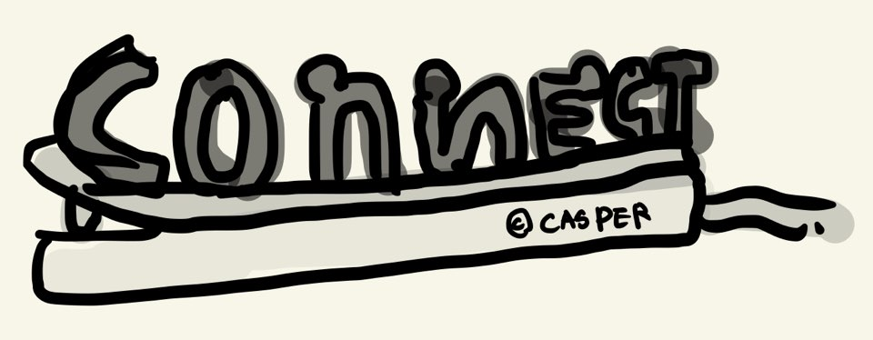

# Connect

## 프로젝트 개요

### 기획 대상

그룹 내부에서 스터디와 프로젝트, CTF 모집 및 진행을 중계하며 그렇게 진행된 교육과 스터디 자료들을 쉽게 찾아 볼 수 있도록 하는 웹 서비스

  
  
    
Connect(서비스명)과 로고의 의미
  
    동아리원들의 연결(협업, 협동)을 중계한다는 의미의 Connect 라는 단어를 사용했다.  
    로고는 각기 다른 대상들을 한데 모으며 에너지를 주는 멀티탭과 이에 연결되는 사람들을 알파벳으로 형상화했다  
    
  

### 기획 목적과 기대효과

교육과 스터디 자료가 쌓여 커리큘럼, 선행 학습, 유사 학습 등의 학습 용도로 활용될 수 있게 하고, 스터디 개설을 자극시키며 운영과 참여가 원활하도록 돕는다. 또한 스터디 뿐 아니라 프로젝트 모집, CTF 모집 등의 모집 관련된 일들도 모두 쉽게 진행할 수 있도록 기획하였다.

비공개되어 내부 인원에게만 제공되기에 동아리 소속의 가치 향상, 지식 축적의 효과를 볼 수 있다.

### 주요 기능

- **교육 자료**  
  스터디나 교육을 진행하며 사용한 자료를 볼 수 있는 기능으로 [프로젝트 매니저](../project-manager/)에서의 프로젝트 글과 동일한 형태를 띄고 있다.  
  교육자료인 PPT 파일의 페이지들을 구역으로 나누어 볼 수 있으며, 추가로 파일을 첨부해줄 수 있다.

- **스터디**  
  개설 희망의 스터디를 각자 어필 할 수 있는 기능, 스터디의 개설자, 참여자를 모집/조사하는 기능, 스터디의 개설/진행/완료를 돕는 기능이다.

- **프로젝트 모집**  
  동아리 내에서 진행하는 프로젝트의 인원을 모집하는 기능이다. 이후의 진행은 대개 카톡을 통해 진행하기 때문에 모집과 현재 인원, 인원모집/활동중/활동완료의 상태 정보만이 제공된다.

- **CTF 활동**  
  참여하고자하는 CTF의 참여 인원을 모집하고 진행 시 필요한 패스워드 등의 고정된 정보를 공유하는 기능이다. Ctf 진행은 대개 카톡으로 진행하기에 이 기능은 카톡에 참여하지 않는 비활동인원(선배, 도중 참여자)를 위한 정보 표시와 CTF 참여 기록 및 결과 표시 목적에 가깝다.

### 부가 기능

- 커리큘럼 (선행학습, 유사학습)  
  만들어지는 교육 자료들을 바탕으로 커리큘럼, 선행학습, 유사학습 등의 기능을 제공.  
  스터디나 프로젝트 자료에서 해당 내용을 이해하기 위해 필요한 학습을 타 자료로 연결해 선행학습을 요구할 수 있고, 해당 내용과 유사한 타 자료를 연결해 유사학습 기능을 제공해줄 수 있다.

- 활동 기록  
  교육, 스터디, 내부 프로젝트, CTF 활동의 기록을 남기기 때문에 비활동 인원 들이 활동 인원들의 활동과 상황에 대해 쉽게 접할 수 있다.

## 프로젝트 구상

[UI/UX Design](./UX_Design.md)
