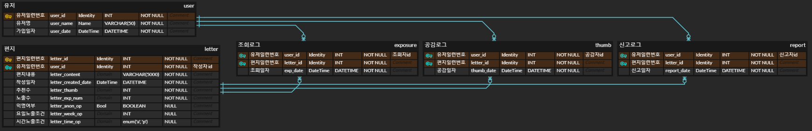

# Message in a bottle (MinBottle)

https://github.com/Nevaland/minbottle

## 프로젝트 개요

병 속에 든 메시지 컨셉의 웹 서비스로 누군가를 위해 메시지들을 작성하면 이 메시지들이 접속자들에게 넘기며 볼 수 있도록 노출되고, 노출 조건 (요일, 시간대), 조회 수, 추천, 신고 기능과 메시지 랜덤의 확률 결정 로직 등이 있다.

### 메시지 예시

랜덤 편지, 오늘의 한마디, 시나 명언이나 구절, 떠오르는 문장, 음악 추천

## 요구 사항

1. 조건에 부합하는 랜덤한 편지를 읽을 수 있다.
   1. 로그인 유저는 조회한 편지는 제외하며, 요일,시간 노출 조건이 있다면 이를 고려하여 랜덤한 편지를 보여준다.
   2. 편지를 보고 공감을 눌러줄 수 있다.
   3. 편지를 보고 신고를 눌러줄 수 있다.
2. oauth를 통한 로그인이 가능하다.
   1. 로그인 한 경우, 조회와 공감 등 본 기능을 모두 사용할 수 있다. (비회원은 조회, 공감 기록 x)
   2. 닉네임을 설정, 변경할 수 있다.
3. 로그인 시 편지를 작성할 수 있다.
   1. 편지내용, 노출 조건, 익명 여부를 작성, 설정할 수 있다.
   2. 편지는 삭제만 가능하며 수정은 불가하다. (조회 0일땐 수정가능하게 할지)
4. 로그인 시 자신이 공감한 글을 볼 수 있으며, 작성한 글도 볼 수 있다.
   1. 공감한 글은 기간 순으로 정렬하며, 작성한 글은 추천순, 기간순으로 정렬해 볼 수 있다.

## DB

domain: letter, user

## Sitemap

letter
letter/new
letter/edit
letter/delete

my/profile
my/sympathyletterlist
my/myletterlist

## Develop Roadmap

1. 글쓰기, 글보기, 글수정, 글삭제
2. Oauth 등의 회원 기능
3. 마이페이지 기능. 글쓰기,삭제,수정,목록
4. 공감기능
5. 신고기능
6. 노출 조건 상세화
7. 목록 정렬, 일자 값 등
