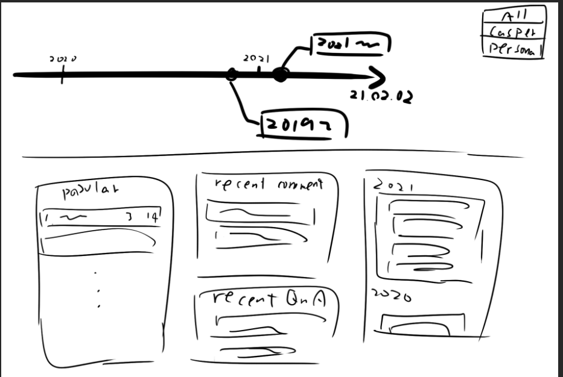
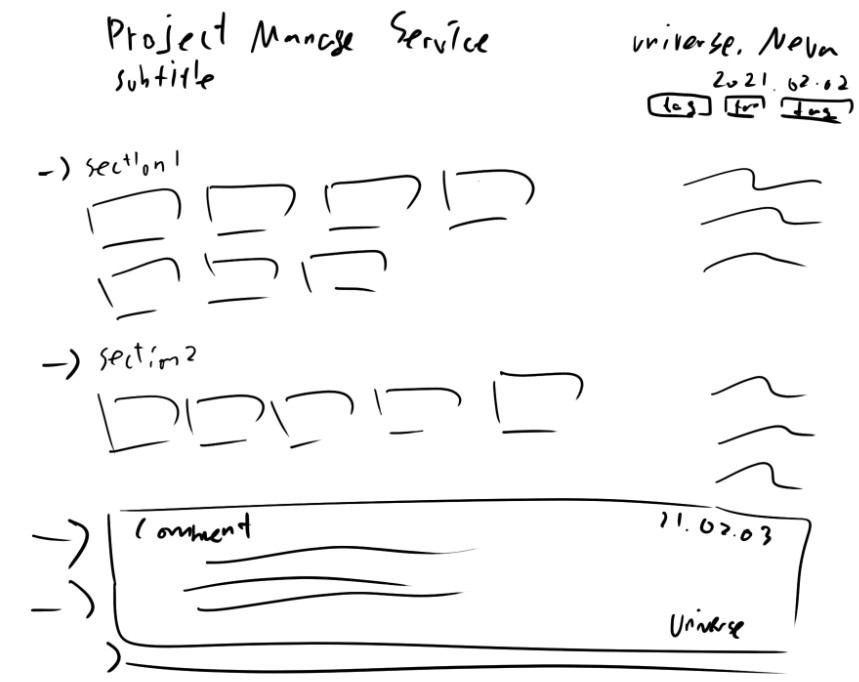
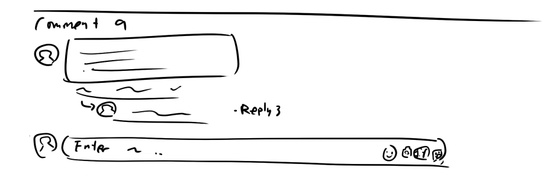

# Project Manager

https://github.com/CASPER-REPSAC/project-manager

## 프로젝트 개요

### 기획 대상

프로젝트(발표) 내용을 공유, 원활한 피드백과 의견 공유를 중계해주는 웹 서비스

### 기획 배경과 목적

프로젝트(발표) 내용의 공유가 접근성이 용이하지 않다는 이유로 원활히 이루어지지 않았고,  
이로 인해 동아리 내의 인적 자원을 효과적으로 활용하지 못해 이를 개선하고자 기획하게 되었다.

### 기대 효과

간편한 프로젝트(발표) 내용 공유와 용이한 접근성을 기반으로 발표를 보지 못한 사람도 쉽게 내용을 볼 수 있고 결국 보다 더 많은 사람들에게 의견을 받고 또 질문을 할 수 있어, 활발한 지식 공유가 가능하게 된다.

또한 동아리 선후배들 간의 소통이 자극되어 동아리 인적 네트워크의 발전과 동아리 내의 소속감, 유대감이 강화된다.

### 주요 기능

- 실시간 타임 라인 차트로 최근 발표 시각화
- 프로젝트 글 작성 (수정, 삭제)
  - 발표 날짜, 작성자, 제목과 부제목, 태그 작성
  - PPT 파일 첨부 후 개별 이미지로 출력
  - PPT 페이지들을 구역으로 묶어 구역명과 구역별 코멘트 작성
- 프로젝트 글에 대한 댓글
  - 댓글에 대한 리댓 기능 (확장형)
- 프로젝트 글에 대한 추천 기능
- 프로젝트와 댓글 목록 (개인/공식 필터)
  - 최신 글, 인기 글, 최신 댓글
- Oauth2 회원 기능, 토큰 값을 이용한 권한 부여

## 프로젝트 구상

- [페이지 구성](#페이지-구성)

### 페이지 구성

1. [메인 페이지](#1-메인-페이지)
   - [메인 페이지 상세보기](./pages/main_page.md)
2. [프로젝트 글 열람](#2-프로젝트-글-열람)
   - [글 열람 페이지 상세보기](./pages/view_page.md)
3. [프로젝트 글 작성](#3-프로젝트-글-작성)
   - [글 작성 페이지 상세보기](./pages/write_page.md)

#### 1. 메인 페이지

  
[메인 페이지 상세보기](./pages/main_page.md)

#### 2. 프로젝트 글 열람

  
  
[글 열람 페이지 상세보기](./pages/view_page.md)

#### 3. 프로젝트 글 작성

  
[글 작성 페이지 상세보기](./pages/write_page.md)
