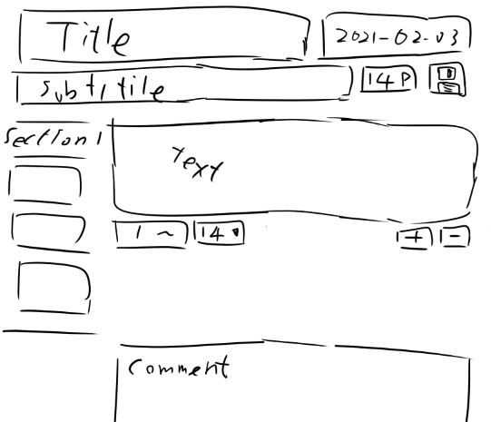
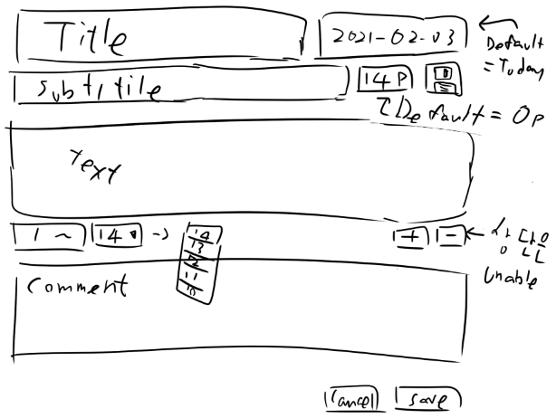
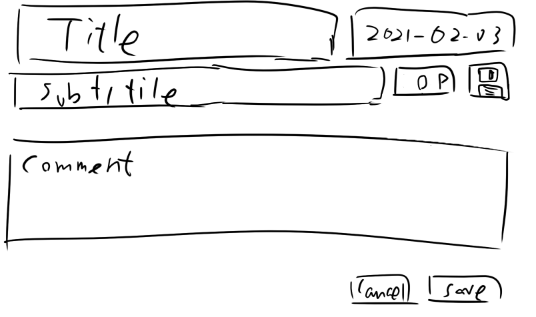
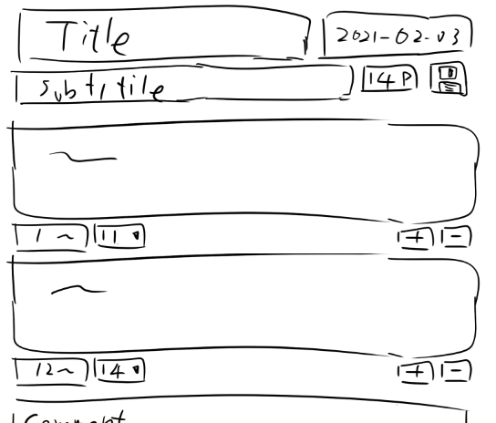

# Write Page

1. [글 작성 페이지](#1-글-작성-페이지)
2. [글 작성 페이지 (Pre-Version)](#2-글-작성-페이지-Pre-Version)  
   2-1. [기본 폼](#2-1-기본-폼)  
   2-2. [진입 시의 폼](#2-2-진입-시의-폼)  
   2-3. [구역 다수 추가 시의 폼](#2-3-구역-다수-추가-시의-폼)

## 1. 글 작성 페이지

## 2. 글 작성 페이지 (Pre-Version)

### 2-1. 기본 폼

### 2-2. 진입 시의 폼

### 2-3. 구역 다수 추가 시의 폼

